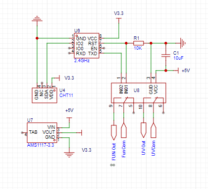

# ESP Garage Dehumidification and Germ Control

Garage ventilation dehumidification and germ control.
Set humidity threshold, open ventilation dehumidification when humidity is higher than the threshold.
Regularly turn on UV light for sterilization to inhibit mold growth in humid environments.

# Circuit Schematic
<!-- Image resource/SCH_Schematic1_1-P1_2024-03-29.png -->

# Bill of Materials

| Component         | Specification/Model | Quantity | Description/Link                                                                                                 |
|-------------------|---------------------|----------|---------------------------------------------------------|
| Microcontroller   | ESP01s              | 1        | [https://item.taobao.com/item.htm?_u=tkum7j2a9f&id=40511001950&spm=a1z09.2.0.0.11332e8dIP0o3o](https://item.taobao.com/item.htm?_u=tkum7j2a9f&id=40511001950&spm=a1z09.2.0.0.11332e8dIP0o3o) |
| Temperature and Humidity Sensor | DHT11 (3Pin) | 1        | [https://detail.tmall.com/item.htm?_u=tkum7j5488&id=681910372753&spm=a1z09.2.0.0.11332e8dIP0o3o](https://detail.tmall.com/item.htm?_u=tkum7j5488&id=681910372753&spm=a1z09.2.0.0.11332e8dIP0o3o) |
| Relay             | 2-channel 5V        | 1        | [https://item.taobao.com/item.htm?_u=tkum7j6d0d&id=572670940948&spm=a1z09.2.0.0.11332e8dIP0o3o](https://item.taobao.com/item.htm?_u=tkum7j6d0d&id=572670940948&spm=a1z09.2.0.0.11332e8dIP0o3o) |
| LDO               | AMS11173.3          | 1        | [https://item.taobao.com/item.htm?_u=tkum7j524c&id=743866354318&spm=a1z09.2.0.0.11332e8dIP0o3o](https://item.taobao.com/item.htm?_u=tkum7j524c&id=743866354318&spm=a1z09.2.0.0.11332e8dIP0o3o) |
| Capacitor         | 10uF Electrolytic   | 1        |   |
| Resistor          | 10k                 | 1        |   |
| Power Supply      | DC5V                | 1        | Old device power supply |
| Enclosure         | 3D Printed          | 1        |   |
| Exhaust Fan       |                     | 1        | [https://buyertrade.taobao.com/trade/itemlist/list_bought_items.htm?spm=a1z02.1.1997525045.2.dFBdMX](https://buyertrade.taobao.com/trade/itemlist/list_bought_items.htm?spm=a1z02.1.1997525045.2.dFBdMX) |
| UV Light          |                     | 1        | [https://detail.tmall.com/item.htm?_u=tkum7jc8cc&id=42245811160&spm=a1z09.2.0.0.11332e8dIP0o3o]   |
| Terminal Connector | P2.54 2x4           | 1        | Connect to ESP01s |
| Terminal Connector | P2.54 1x3           | 2        | (DH11, LDO) |
| Wire              | AWG26/28            | Several  | DC power and signal wires, exhaust fan and UV light power wires use original wires |
