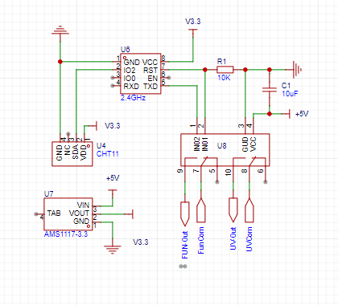

# ESP 车库除湿抑菌控制器

车库通风除湿、抑菌控制。
可设定湿度阈值，大于湿度开启通风除湿。
定期打开UV灯进行杀菌，抑制湿热环境霉菌生长。

# 电路原理
<!-- 图片 resource/SCH_Schematic1_1-P1_2024-03-29.png -->

# BOM

| 组件               | 规格型号      | 数量 | 说明/链接                                                                                                 |
|-------------------|------------|------|---------------------------------------------------------|
| 单片机           | ESP01s     |  1    | [https://item.taobao.com/item.htm?_u=tkum7j2a9f&id=40511001950&spm=a1z09.2.0.0.11332e8dIP0o3o](https://item.taobao.com/item.htm?_u=tkum7j2a9f&id=40511001950&spm=a1z09.2.0.0.11332e8dIP0o3o) |
|   温湿度传感器    | DHT11 （3Pin） | 1      | [https://detail.tmall.com/item.htm?_u=tkum7j5488&id=681910372753&spm=a1z09.2.0.0.11332e8dIP0o3o](https://detail.tmall.com/item.htm?_u=tkum7j5488&id=681910372753&spm=a1z09.2.0.0.11332e8dIP0o3o) |
| 继电器       |    2路5V          |  1     | [https://item.taobao.com/item.htm?_u=tkum7j6d0d&id=572670940948&spm=a1z09.2.0.0.11332e8dIP0o3o](https://item.taobao.com/item.htm?_u=tkum7j6d0d&id=572670940948&spm=a1z09.2.0.0.11332e8dIP0o3o) |
| LDO    |          AMS11173.3    |    1  | [https://item.taobao.com/item.htm?_u=tkum7j524c&id=743866354318&spm=a1z09.2.0.0.11332e8dIP0o3o](https://item.taobao.com/item.htm?_u=tkum7j524c&id=743866354318&spm=a1z09.2.0.0.11332e8dIP0o3o) |
| 电容   |      10uF 电解质      |  1    |   |
|电阻          |  10k  |   1   |   |
| 电源          |    DC5V         |   1   | 旧设备电源 |
| 外壳    |       3D打印     |   1   |   |
| 排气扇            |            |   1   | [https://buyertrade.taobao.com/trade/itemlist/list_bought_items.htm?spm=a1z02.1.1997525045.2.dFBdMX](https://buyertrade.taobao.com/trade/itemlist/list_bought_items.htm?spm=a1z02.1.1997525045.2.dFBdMX) |
| UV灯              |            |  1    | [https://detail.tmall.com/item.htm?_u=tkum7jc8cc&id=42245811160&spm=a1z09.2.0.0.11332e8dIP0o3o]   |
| 端子母壳 |       P2.54 2x4       |  1    | 接ESP01s |
|  端子母壳 |      P2.54 1x3       |  2    | （DH11,LDO） |
|线 |      AWG26/28     | 若干     |  DC电源和信号线，排气扇、UV灯电源线使用商品原线 |

